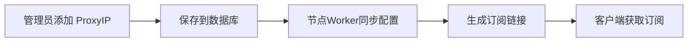

# Cloudflare 1034 错误完整解决方案

## 🎯 问题核心

访问套了 Cloudflare CDN 的网站时报错 **1034: Edge IP Restricted**，而访问其他网站正常。

## 📊 技术分析

### 错误原因

```
客户端 → CF Worker (IP: 104.x.x.x) → 目标网站 (CF CDN)
                                           ↓
                                  检测到来源是 CF IP
                                           ↓
                                      返回 Error 1034
                                   (防止 CF → CF 循环请求)
```

Cloudflare 的安全机制会阻止来自 Cloudflare 自身 IP 的请求，防止：
1. 循环请求（CF Worker → CF CDN → CF Worker → ...）
2. 资源滥用
3. DDoS 攻击

### ProxyIP 的真实作用

**❌ 错误理解**：ProxyIP 是代理服务器，Worker 会通过它转发流量

**✅ 正确理解**：ProxyIP 是 **反代域名**，用于订阅配置中的连接地址

#### ProxyIP 配置流程



#### 实际问题

当前代码中，ProxyIP 只是保存了，但：

1. **订阅生成时**：使用的是 `bestDomains`，不是 `proxyIPs`
2. **Worker 连接时**：直接连接目标地址，没有使用 ProxyIP
3. **Worker 出站限制**：所有连接都来自 CF IP 池，无法改变

### 代码验证

#### User-Manager-Worker.js (管理端)

```javascript:User-Manager-Worker.js
// ✅ 保存逻辑正确
async function handleAdminSaveSettings(request, env) {
  const proxyIPStr = formData.get('proxyIP');
  let proxyIPs = proxyIPStr ? proxyIPStr.split(/[\n,]+/).map(...) : [];
  
  const settings = { ...currentSettings, proxyIPs, bestDomains, subUrl, websiteUrl };
  await env.DB.prepare("INSERT OR REPLACE INTO settings (key, value) VALUES (?, ?)")
    .bind(SYSTEM_CONFIG_KEY, JSON.stringify(settings))
    .run();
}

// ✅ API 输出正确
async function handleApiData(request, env) {
  return new Response(JSON.stringify({
    users: users,
    settings: settings  // ← 包含 proxyIPs
  }), {...});
}
```

#### Node-Worker.js (节点端)

```javascript:Node-Worker.js
// ✅ 同步逻辑正确
if (Array.isArray(data.settings.proxyIPs) && data.settings.proxyIPs.length > 0) {
    settings.proxyIPs = data.settings.proxyIPs;
}

// ❌ 问题：订阅生成时没有使用 proxyIPs
function generateVlessLinks(workerDomain, uuid, userName, expiry, websiteUrl) {
    const domains = cachedData.settings.bestDomains;  // ← 只用了 bestDomains
    // ProxyIPs 没有被使用！
}

// ❌ 问题：连接时直接连目标，没有使用 ProxyIP
socket = connect({
    hostname: targetAddress,  // ← 直接连接目标
    port: targetPort
});
```

## ✅ 解决方案

### 方案一：使用优选IP（推荐）⭐

#### 原理
通过非 Cloudflare IP 接入，避开 CF 检测：

```
客户端 → 优选IP(146.x.x.x) → CF CDN → Worker → 目标网站
         非CF IP，不触发1034
```

#### 操作步骤

1. **登录管理后台**

2. **进入【全局配置】→【优选域名管理】**

3. **添加真实的优选IP**：
   ```
   146.56.130.12:443#电信优选
   104.18.0.1:443#联通优选
   172.64.32.1:443#移动优选
   ```

4. **清空 ProxyIP 配置**（当前架构下无效）

5. **点击【保存配置】**

6. **更新订阅**：在客户端中重新获取订阅

7. **选择优选IP节点**：使用标注了"优选"的节点访问CF CDN网站

#### 验证

访问节点 Worker 的 `/debug` 接口：

```bash
curl https://your-node-worker.workers.dev/debug | jq .settings.bestDomains
```

应该看到：
```json
[
  "146.56.130.12:443#电信优选",
  "104.18.0.1:443#联通优选",
  ...
]
```

### 方案二：修改代码使 ProxyIP 生效（复杂）⚠️

需要修改订阅生成逻辑和连接逻辑，但由于 Worker 的限制，效果有限。

#### 修改 1：订阅生成使用 ProxyIP

```javascript:Node-Worker.js
function generateVlessLinks(workerDomain, uuid, userName, expiry, websiteUrl) {
    const links = [];
    
    // 优先使用 proxyIPs
    const proxyList = cachedData.settings.proxyIPs || [];
    const domains = cachedData.settings.bestDomains || [];
    
    // 合并：ProxyIP + bestDomains
    const allAddresses = [...proxyList, ...domains];
    
    allAddresses.forEach((item, index) => {
        // 生成订阅链接...
    });
}
```

#### 修改 2：在订阅链接中指定 ProxyIP

```javascript:Node-Worker.js
// 为每个节点指定使用 ProxyIP
const params = new URLSearchParams({
    encryption: 'none',
    security: 'tls',
    sni: workerDomain,
    fp: 'chrome',
    type: 'ws',
    host: workerDomain,
    path: wsPath
});

// @ 后面使用 ProxyIP 作为连接地址
const vlessLink = `vless://${uuid}@${proxyIPAddress}?${params}#${nodeName}`;
```

#### 限制

- Worker 无法改变出口 IP
- ProxyIP 域名本身可能也指向 Cloudflare
- 效果不如直接使用优选 IP

### 方案三：使用外部代理（不推荐）❌

配置真实的 HTTP/SOCKS5 代理服务器，Worker 通过代理连接目标。

**缺点**：
- 成本高
- 速度慢
- 维护复杂
- Worker 对代理支持有限

## 🔍 排查清单

### 1. 检查管理端配置

访问：`https://your-manager.workers.dev/api/users`

```json
{
  "users": {...},
  "settings": {
    "proxyIPs": ["..."],  ← 检查这里
    "bestDomains": ["..."]
  }
}
```

### 2. 检查节点端同步

访问：`https://your-node.workers.dev/debug`

```json
{
  "users": {...},
  "settings": {
    "proxyIPs": ["..."],  ← 应该和管理端一致
    "bestDomains": ["..."]
  },
  "lastUpdate": "2026-01-10T...",
  "apiUrl": "https://..."
}
```

### 3. 检查订阅内容

在客户端获取订阅后，导出节点配置，检查连接地址（@ 后面的部分）。

### 4. 测试不同节点

- 测试直连节点 → 可能报 1034
- 测试优选IP节点 → 应该正常
- 访问非CF网站 → 都应该正常

## 💡 常见问题

### Q1: 为什么添加 ProxyIP 后还是报 1034？

**A**: 因为当前代码架构下，ProxyIP 没有真正参与流量转发。Worker 仍然直接连接目标地址，使用的是 CF IP。

### Q2: ProxyIP 和 bestDomains 有什么区别？

**A**: 
- **ProxyIP**: 原本设计用于代理，但当前代码中未真正使用
- **bestDomains**: 用于生成订阅节点，客户端会连接这些地址

### Q3: 删除后重新添加能解决吗？

**A**: 不能。问题不在配置保存，而在代码逻辑和 Worker 的架构限制。

### Q4: 可以同时使用 ProxyIP 和优选IP吗？

**A**: 可以都配置，但建议优先使用优选IP（添加到 bestDomains）。

### Q5: 如何获取优选IP？

**A**: 
1. 使用管理面板的【自动抓取优选IP】功能
2. 访问优选IP网站：https://www.wetest.vip/page/cloudflare/address_v4.html
3. 使用第三方工具测试

## 📝 总结

1. **ProxyIP 配置功能正常**，问题在于代码没有真正使用它
2. **推荐方案**：清空 ProxyIP，在 bestDomains 中添加真实的优选IP
3. **根本原因**：Worker 出站连接限制，无法改变出口IP
4. **长期方案**：修改代码架构，或使用外部代理服务

## 🚀 快速修复命令

```bash
# 1. 检查配置同步
curl https://your-manager.workers.dev/api/users | jq .settings

# 2. 检查节点状态
curl https://your-node.workers.dev/debug | jq .settings

# 3. 查看排查脚本
bash /workspaces/vles/fix-1034-error.sh
```

---

**最后更新**: 2026-01-10
**相关文件**: [debug-proxyip.md](debug-proxyip.md), [fix-1034-error.sh](fix-1034-error.sh)
